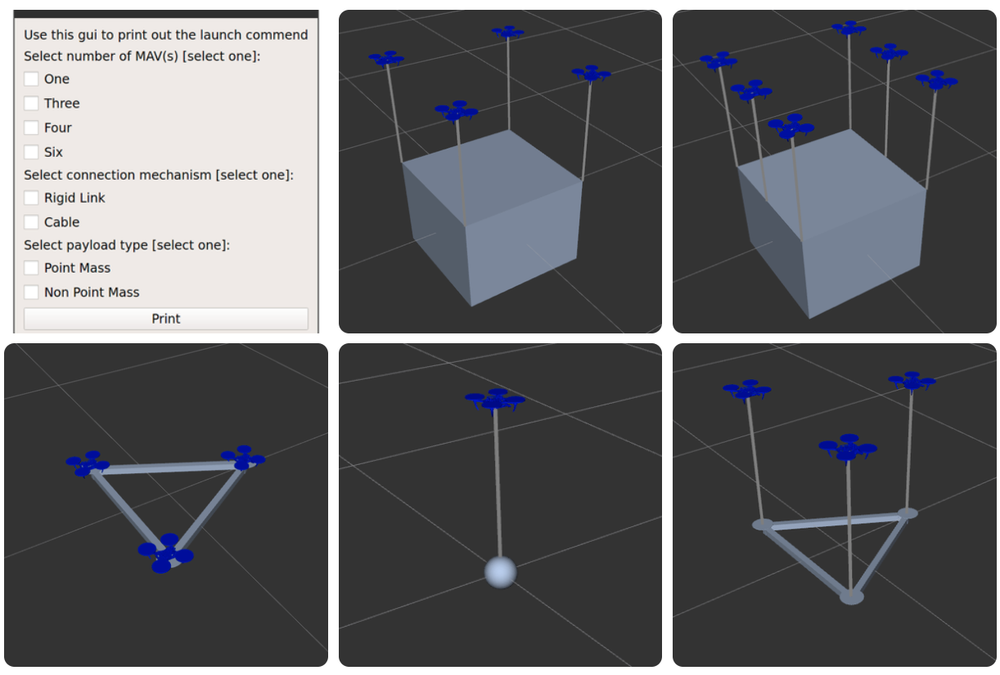
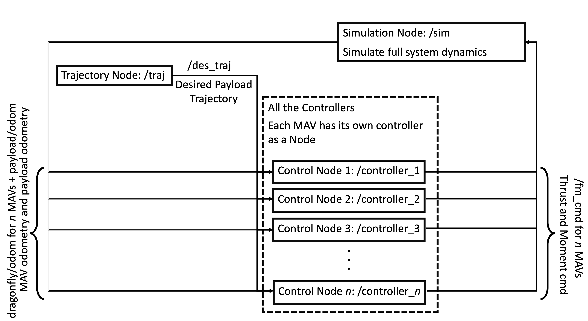

# RotorTM
An Aerial Transportation and Manipulation Simulator for Research and Education

## Overview
#### Description
RotorTM is an aerial transportation and manipulation simulator of MAVs with different payloads and passive connection mechanisms. It incorporates full system
dynamics as well as planning, and control algorithms for aerial transportation and manipulation. Furthermore, it includes a hybrid model accounting for the transient hybrid dynamics for aerial systems with cable suspended load to mimic real-world systems. It also provides flexible interfaces to planning and control software modules for the users. 

If you have any questions regarding the repo or how to use the simulator please feel free to post questions in the Issues. 



**Developer: Guanrui Li, Xinyang Liu<br />
Affiliation: [NYU ARPL](https://wp.nyu.edu/arpl/)<br />
Maintainer: Guanrui Li (lguanrui@nyu.edu), Xinyang Liu (thomas.xinyang.liu@nyu.edu)<br />**

## ROS Organization
The ROS Organization is shown in the figure below. 

The table below also summarized the publication and subsecption scheme. `#` is used to denote MAV number.
|Name|Description|Publications|Subscriptions|Services|
|---|---|---|---|---|
|`/controller_#`|Control MAV(s) to follow desired trajectory|/controller_#/dragonfly#/fm_cmd|/dragonfly#/odom
||||/payload/des_traj|
||||/payload/odom|
|`/sim`|Simulate full system dynamics and publish all relevant Odometries for payload and MAV(s)|/dragonfly#/odom|/controller_#/dragonfly#/fm_cmd
|||/payload/odom|
|`/traj`|Compute and publish the payload desired trajectory|/payload/des_traj||/traj_generator/Circle
|||||/traj_generator/Line
|||||/traj_generator/Min_Derivative_Line

## Parameters Files
These files are used to set properties of the MAV(s).
|Name|Description|
|---|---|
|`UAV Params`|Basic UAV parameters like |
|`Payload Params`|Basic payload parameters like mass, moment of inertia etc.|
|`UAV Controller Params`|UAV controller parameters|
|`Payload Controller Params`|Payload controller parameters|
|`Attach Mechanism Params`|Attach mechanism parameters|

## Dependencies and Installation
The RotorTM package is dependent on `Python 3.8` and `ROS Noetic/Melodic`. Please ensure `Python 3.8` as other python version may lead to build and import error. Python packages including `numpy`, `scipy`, and `cvxopt` should be installed with `pip install` (latest version). `PyQt5` is used to implement the GUI, which is included as a site package if `Python 3.8` is install. 
```
$ pip install numpy==1.22.1
$ pip install scipy==1.8.0
$ pip install cvxopt==1.2.7
$ pip install PyQt5
```


After installation of necessary packages, clone the repo and `catkin_make` the ROS workspace. Source the `setup.bash` file inside the devel folder.

```
$ cd /path/to/your/workspace/src
$ git clone --branch Python/ROS https://github.com/arplaboratory/RotorTM.git
$ catkin_make
$ source ~/path/to/your/workspace/devel/setup.bash
```

##  Running
### Use Launch Command GUI
Go into the RotorTM folder and type the following in the command to run the GUI.
```
$ cd /path/to/your/workspace/src/RotorTM
$ python gui.py 
```


Use the check boxes to select the desired combination. The GUI will automatically disable any illegal selection(s). Once the desired combination is selected, click Print. The launch command will be printed in the command window. Close the GUI to reset all check boxes. Copy and paste the command into the command window and enter. The simulator and visualizer will be initilated.

### Start simulation
After calling the launch file, the MAV(s) and payload is hovering at a predetermined initial location. To start simulation, desired trajectory needs to be generated by `/traj` node. `/traj` node has been set up with three ROS services corresponding to three possible trajectory generators. 
|Service|Description|
|---|---|
|`/traj_generator/Line`|circular trajectory generator
|`/traj_generator/Circle`|line trajectory generator|unlimited 
|`/traj_generator/Min_Derivative_Line`|minimum derivative trajectory generator

The location of service call definition is `RotorTM/rotor_tm_traj/srv`. Directly calling the services would start the simulation by activating the publication of `payload/des_traj`.

Here is an example of generating a circular trajectory with radius = 1.0 meter , period = 10 seconds, and duration = 10 seconds:
```
$ rosservice call /traj_generator/Circle 1.0 10.0 10.0
```
Another example of generating a line trajectory with from point [0,0,0] to [1,1,1]:
```
$ rosservice call /traj_generator/Line "path:
  - x: 1.0
    y: 1.0
    z: 1.0"
```
## Trajectory Generator
### Line Trajectory Generator
The line trajectory generator will generate a sequence of points connecting the given waypoint. The path simply connects all the points with straight lines. 

### Circular Trajectory Generator
The circular trajectory generator will generate a circular trajectory such that it will  
 1. ramp up to a constant speed
 2. run several cycles of circles ( depending on the period and duration)
 3. ramp down to zero speed. 

Here are the parameters to set for generating the circular trajectory:
|Name|Chosen Files|
|---|---|
|`Radius`|`The radius of the circular trajectory`|
|`Period`|`The period time of finishing one circle`|
|`Duration`|`The total time of the circular trajectory`|

### Minimum Derivative Trajectory Generator
The minimum_derivative trajectory generator will generate a trajectory that goes through a given path. The path will avoid sharp turning and sudden change of directions.